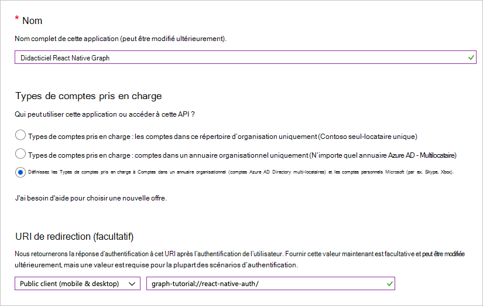

<!-- markdownlint-disable MD002 MD041 -->

Dans cet exercice, vous allez créer une application native Azure AD à l’aide du Centre d’administration Azure Active Directory.

1. Ouvrez un navigateur, accédez au [Centre d’administration Azure Active Directory](https://aad.portal.azure.com) et connectez-vous à l’aide d’un **compte personnel** (ou compte Microsoft) ou d’un **compte professionnel ou scolaire**.

1. Sélectionnez **Azure Active Directory** dans le volet de navigation gauche, puis sélectionnez **Inscriptions d’applications** sous **Gérer**.

    

1. Sélectionnez **Nouvelle inscription**. Sur la page **Inscrire une application**, définissez les valeurs comme suit.

    - Définissez le **Nom** sur `React Native Graph Tutorial`.
    - Définissez les **Types de comptes pris en charge** sur **Comptes dans un annuaire organisationnel et comptes personnels Microsoft**.
    - Sous **URI de redirection,** modifiez la liste de listes en **client public (mobile & bureau)** et définissez la valeur sur `graph-tutorial://react-native-auth/` .

    

1. Sélectionner **Inscription**. Dans la page **Didacticiel React Native Graph,** copiez la valeur de l’ID de l’application **(client)** et enregistrez-la, vous en aurez besoin à l’étape suivante.

    
