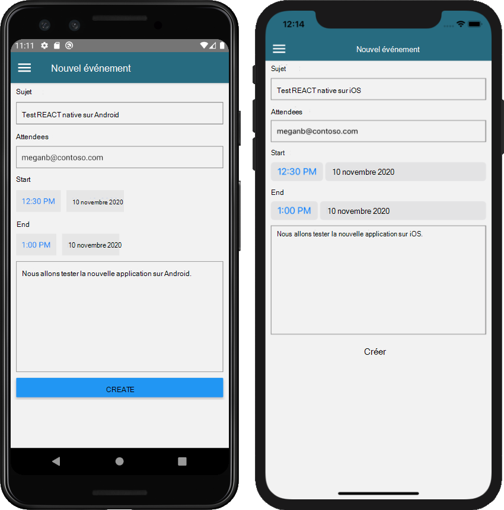

<!-- markdownlint-disable MD002 MD041 -->

Dans cette section, vous allez ajouter la possibilité de créer des événements dans le calendrier de l’utilisateur.

## <a name="create-the-new-event-screen"></a>Créer l’écran des événements

1. Ouvrez **./Graph/GraphManager.TS** et ajoutez la fonction suivante à la `GraphManager` classe.

    :::code language="typescript" source="../demo/GraphTutorial/graph/GraphManager.ts" id="CreateEventSnippet":::

    Cette fonction utilise le kit de développement logiciel (SDK) Graph pour créer un événement.

1. Créez un fichier au format **./Screens** nommé **NewEventScreen. TSX** et ajoutez le code suivant.

    :::code language="typescript" source="../demo/GraphTutorial/screens/NewEventScreen.tsx" id="NewEventScreenSnippet":::

    Tenez compte de ce que `createEvent` fait la fonction. Il crée un `MicrosoftGraph.Event` objet à l’aide des valeurs du formulaire, puis transmet cet objet à la `GraphManager.createEvent` fonction.

1. Ouvrez **./menus/DrawerMenu.TSX** et ajoutez l' `import` instruction suivante en haut du fichier.

    ```typescript
    import NewEventScreen from '../screens/NewEventScreen';
    ```

1. Ajoutez le code suivant à l’intérieur de l' `<Drawer.Navigator>` élément, juste au-dessus de la `</Drawer.Navigator>` ligne.

    ```typescript
    { userLoaded &&
      <Drawer.Screen name='NewEvent'
        component={NewEventScreen}
        options={{drawerLabel: 'New event'}} />
    }
    ```

1. Enregistrez vos modifications et redémarrez ou actualisez l’application. Sélectionnez l’option **nouvel événement** dans le menu pour accéder au nouveau formulaire événement.

1. Remplissez le formulaire et sélectionnez **créer**.

    
